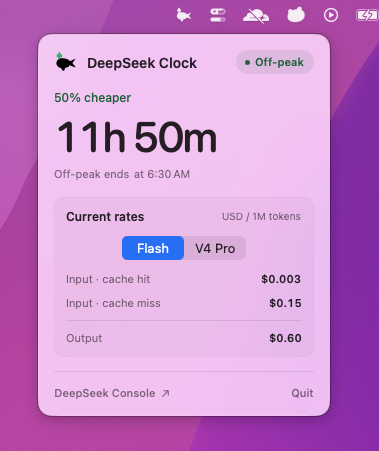

# DeepSeek Clock 🐋

> DeepSeek peak and off-peak pricing, in your menu bar.

[](https://github.com/jaibhasin/deepseek-clock/releases/latest)


[](https://github.com/jaibhasin/homebrew-tap)
[](LICENSE)



See when DeepSeek is half price without checking the clock yourself.
Click the menu bar icon for current Flash and V4 Pro rates, a countdown to the next price change, and the time it happens in your timezone.

Native macOS app.
No account or backend needed.

## Pricing schedule

- Peak: Monday-Friday, 01:00-04:00 and 06:00-10:00 UTC.
- Off-peak: all other times, at half price.

Times are shown in your Mac's local timezone.
The app works out pricing locally using the rates in `Sources/DeepSeekClock/DeepSeekPricing.swift`.

## Install

Requires an Apple Silicon Mac running macOS 13 or later.

```sh
brew install --cask jaibhasin/tap/deepseek-clock
```

Then open DeepSeek Clock from Applications.
The app is not notarized, so macOS may require approval in System Settings > Privacy & Security on first launch.

## Build and run

You'll need macOS 13+ and Swift 5.9 or later.

```sh
./build.sh
open DeepSeekClock.app
```

## Tests

```sh
swift test
```

## License

MIT
